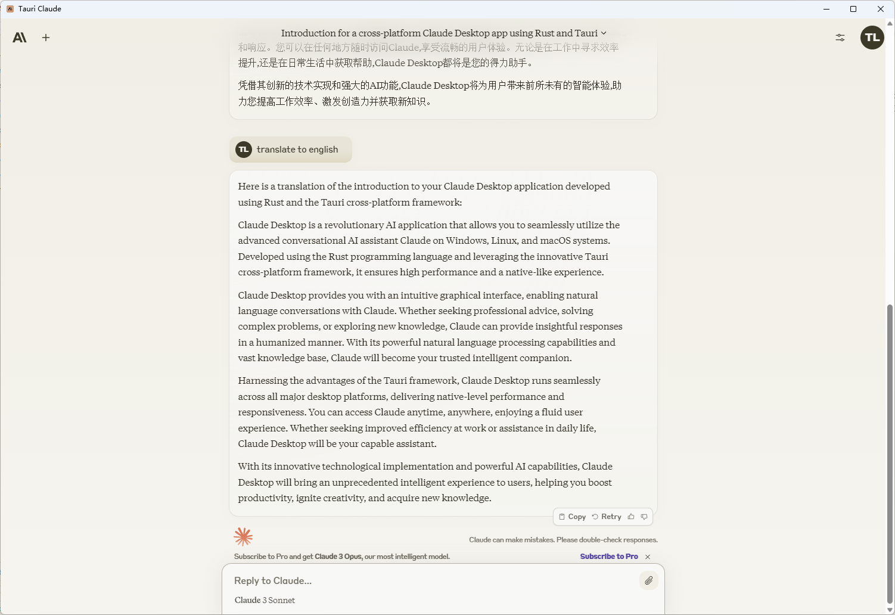

## tauri-claude

Claude Desktop is a revolutionary AI application that allows you to seamlessly utilize the advanced conversational AI assistant Claude on Windows, Linux, and macOS systems. Developed using the Rust programming language and leveraging the innovative Tauri cross-platform framework, it ensures high performance and a native-like experience.

Claude Desktop provides you with an intuitive graphical interface, enabling natural language conversations with Claude. Whether seeking professional advice, solving complex problems, or exploring new knowledge, Claude can provide insightful responses in a humanized manner. With its powerful natural language processing capabilities and vast knowledge base, Claude will become your trusted intelligent companion.

Harnessing the advantages of the Tauri framework, Claude Desktop runs seamlessly across all major desktop platforms, delivering native-level performance and responsiveness. You can access Claude anytime, anywhere, enjoying a fluid user experience. Whether seeking improved efficiency at work or assistance in daily life, Claude Desktop will be your capable assistant.

With its innovative technological implementation and powerful AI capabilities, Claude Desktop will bring an unprecedented intelligent experience to users, helping you boost productivity, ignite creativity, and acquire new knowledge.



## Features
* **Native Experience**: Interact with Claude directly from your desktop without needing a browser.
* **Fast and Lightweight**: Built using Tauri, the application is light on resources and starts up quickly.
* **Cross-Platform**: Available for Windows, macOS, and Linux.

## Installation

### Pre-built binaries
You can download the pre-built binaries for your platform from the [Releases](https://github.com/litongjava/tauri-claude/releases) page.

### Building from Source

1. Clone this repository:
    ```bash
    git clone https://github.com/litongjava/tauri-claude
    ```
2. Navigate to the project directory:
    ```bash
    cd tauri-claude
    ```
3. Install tauri:
    ```bash
    cargo install tauri-cli
    ```
4. Build the application:
    ```bash
    cargo tauri build
    ```

## Usage

1. Launch the application.
2. Interact with claude directly from the app interface.

## Cache
Cache Folder
- windows C:\Users\Administrator\AppData\Local\com.litongjava.tauri.claude
## Contributing

Pull requests are welcome! For major changes, please open an issue first to discuss what you'd like to change.

## License

[MIT License](LICENSE)


